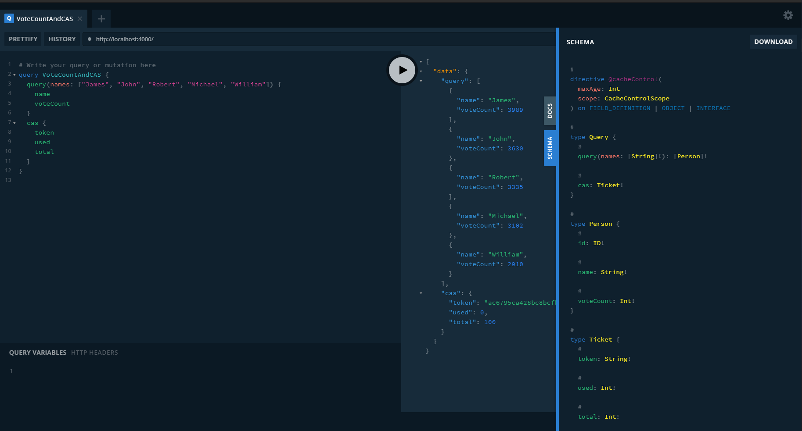

# Little Vote Server

## Quick Start

### Dependency

You'll need `node`, `npm`, `postgresql` to deploy the server.

For `node` and `npm`, refer to [this site](https://nodejs.org/en/download) to  install it on whatever platform you're on.

For `postgresql`, refer to [this site](https://www.postgresql.org/download/)

And `k6` on [this site](https://k6.io/docs/getting-started/installation/)

And you'll need `k6` to do the load test.

`node` packages are defined in `package.json` and can be installed by `npm install`

### Database

To setup `postgres` for this server:

```shell
sudo -u postgres createuser -P -s xzdd # to create the user for postgres
# YOU'LL BE PROMPTED TO ENTER THE PASSWORD HERE
# WE USED xzdd FOR PASSWORD IN OUR DB
# if you're on windows, use createuser -P -U postgres xzdd
createdb littlevotedb -U xzdd # to create the database
node ./src/test/addnames.js # to insert some dummy names into the database
```

To change the database configuration this server uses, open `src/utils.js` and edit `username`, `password` and stuff.

### Ignition

Use this script to clone and run the server.

```shell
git clone https://github.com/dendenxu/LittleVoteServer.git # to clone this repo
cd LittleVoteServer

npm install # to install packages defined in package.json
npm start # to start the server, running on port 4000
```

Now go to http://localhost:4000 to see a `GraphQL` playground like this:



If see errors regarding the database in the log, you should set up `postgres` first. Refer to the previous subsection.

To change the port or ticket valid interval or ticket usage limit, open `src/index.js` and change `SERVER_PORT`, `TICKET_VALID_INTERVAL`, `TICKET_TOTAL_USAGE_LIMIT`

### Test

To run the test a small smoke test:

```shell
k6 run --iterations 1 --vus 1 ./src/test/graph.js
```

To run a predefined load test:

```shell
k6 run --duration 20s --vus 50 ./src/test/graph.js
# Or just k6 run ./src/test/graph.js since they're already defined in graph.js
```


## Interface

### Definition

See `src/schema.js` for the `GraphQL` definition.

Here's a copy of the file:

```javascript
const { gql } = require('apollo-server');

const typeDefs = gql`

  type Person {
    id: ID!
    name: String!
    voteCount: Int!
  }

  type Ticket {
    token: String! # shoule be a random ticket
    used: Int!
    total: Int!
  }

  type Query {
    query(names: [String]!): [Person]!
    
    cas: Ticket!
  }

  type Mutation {
    vote(names: [String]!, token: String!): VoteUpdateResponse!
  }

  type VoteUpdateResponse {
    success: Boolean!
    message: String
    updated: [Person] # array of Person modified by this mutation, no need to fetch again
  }
`;

module.exports = typeDefs;
```

### Example

Example:

```graphql
# Write your query or mutation here
query VoteCountAndCAS {
  query(names: ["James", "John", "Robert", "Michael", "William"]) {
    name
    voteCount
  }
  cas {
    token
    used
    total
  }
}
```

Example Result:

```json
{
  "data": {
    "query": [
      {
        "name": "James",
        "voteCount": 3989
      },
      {
        "name": "John",
        "voteCount": 3630
      },
      {
        "name": "Robert",
        "voteCount": 3335
      },
      {
        "name": "Michael",
        "voteCount": 3102
      },
      {
        "name": "William",
        "voteCount": 2910
      }
    ],
    "cas": {
      "token": "ac6795ca428bc8bcfb5a22211833088d",
      "used": 0,
      "total": 100
    }
  }
}
```


## Validation

### Functionality

We tested the functionality using `postman`, with global variables:

```json
{
    "key": "token",
    "value": "4608e5ed0abfd65b468e8822705797f7",
},
{
    "key": "names",
    "value": "[\"James\", \"John\", \"Robert\", \"Michael\", \"William\"]",
},
```

Note that `token` will be updated.

1. `cas` for the ticket

    Query:

    ```graphql
    query Ticket {
        cas {
            token
            used
            total
        }
    }
    ```

    Result:

    ```json
    {
        "data": {
            "cas": {
                "token": "ce73b55f6512c1c9260788f976cee9f4",
                "used": 0,
                "total": 100
            }
        }
    }
    ```

    

    We added these `postman` test script to automate the testing:

    ```javascript
    var jsonData = pm.response.json();
    const token = jsonData.data.cas.token;
    const old = pm.globals.get("token");
    const names = pm.globals.get("names");
    if (token !== old) {
        console.log(`Setting new token: ${token}, old: ${old}`);
        pm.globals.set("token", token);
    } else {
        console.log(`Token ${old} is currently valid`);
    }
    
    console.log(`Names: ${names}`);
    ```

    This script updates some global variable so we can make the `vote` mutation without hard coding the token(ticket).

2. `query` for the vote count for some specific names

    ```graphql
    # Write your query or mutation here
    query People($names: [String]!) {
      query(names: $names) {
        name
        voteCount
      }
    }
    ```

    `GraphQL` variables:

    ```json
    {
        "names": {{names}} // ["James", "John", "Robert", "Michael", "William"]
    }
    ```

    Result:

    ```json
    {
        "data": {
            "query": [
                {
                    "name": "William",
                    "voteCount": 57
                },
                {
                    "name": "James",
                    "voteCount": 111
                },
                {
                    "name": "John",
                    "voteCount": 87
                },
                {
                    "name": "Michael",
                    "voteCount": 66
                },
                {
                    "name": "Robert",
                    "voteCount": 75
                }
            ]
        }
    }
    ```

    

3. `vote` to vote for specific candidate(s)

    Mutation:

    ```graphql
    mutation Vote($names: [String]!, $token: String!) {
        vote(names: $names, token: $token) {
            success
            message
            updated {
                name
                voteCount
            }
        }
    }
    ```

    `GraphQL` variable:

    ```json
    {
        "names": {{names}}, // ["James", "John", "Robert", "Michael", "William"]
        "token": "{{token}}" // f89d3bc6be82c338b06d977676cabc29
    }
    ```

    To test this function, we'll need to remember the token and use it "immediately", and 2s is a little bit too short.

    So we modified the valid interval for our ticket to 100s, just for testing.

    First we executed query `cas` and updated global: `token`

    

    Then we run the mutation mentioned above.

    Result:

    ```json
    {
        "data": {
            "vote": {
                "success": true,
                "message": "All candidates were successfully updated.",
                "updated": [
                    {
                        "name": "James",
                        "voteCount": 112
                    },
                    {
                        "name": "John",
                        "voteCount": 88
                    },
                    {
                        "name": "Robert",
                        "voteCount": 76
                    },
                    {
                        "name": "Michael",
                        "voteCount": 67
                    },
                    {
                        "name": "William",
                        "voteCount": 58
                    }
                ]
            }
        }
    }
    /* Previously was:
    {
        "data": {
            "query": [
                {
                    "name": "William",
                    "voteCount": 57
                },
                {
                    "name": "James",
                    "voteCount": 111
                },
                {
                    "name": "John",
                    "voteCount": 87
                },
                {
                    "name": "Michael",
                    "voteCount": 66
                },
                {
                    "name": "Robert",
                    "voteCount": 75
                }
            ]
        }
    }
    */
    ```

    

    Note that corresponding `voteCount` are updated correctly.

    And let's test whether a ticket can be used up (note that we assume a ticket can only be used to vote `100` times):

    First runs yields similar result (`voteCount` updated)

    

    And the last `vote` failed, yielding no updated field, since the ticket has been used up:

    

    This can also be observed here in the server log:

    

### Load Test

We used `k6` for load testing.

The testing script `graph.js` is stored under the `test` directory of `src` directory.

It creates `50` virtual users to concurrently send query and mutation to the server, with an `100ms` interval, for `20s`


Requests are sent in this order:

1. Query the `voteCount` for `["James", "John", "Robert", "Michael", "William"]`. Five people.
2. Query and update the `ticket` for this virtual user, so that it can be reused immediately.
3. Vote for the five people mentioned above using the updated `ticket` token.


Note that the ticket is valid for `2 seconds` and each can be used to vote `100 times` for some candidates.


It can be observed that:

1. Our server can handle concurrency and race conditions correctly.
2. Response time is reasonable with `50` rapidly updating virtual user.

Note from the server log that:

1. Ticked are used up as expected
2. Pending request with old ticket will not succeed
3. Server can quickly issue new ticket


## Appendix: Requirements

> ## 概述
>
> 设计一个投票程序，用户可以使用该程序给指定的用户名投票，同时用户也可以查询指定用户名的当前票数。
>
> 1. 该程序需要每 2 秒随机生成一个`ticket`，由服务端产生，并且提供相应的接口获取该`ticket`，每个`ticket`的有效时间是从服务端生成到下一次生成新的`ticket`为止
> 2. 在`ticket`的有效期间内，支持给任意用户投任意次数的票。并且每个`ticket`的使用次数存在一个上限
>
> ## 接口设计
>
> 1. 投票`vote`
>
>     ```text
>     输入：指定的用户名（支持多个）
>     输出：ticket
>     行为：检查ticket是否合法，合法则将指定的（多个）用户的票数＋1
>     输出：投票结果
>     ```
>
> 2. 查询`query`
>
>     ```text
>     输⼊: 指定的⽤户名
>     输出：指定⽤户的当前票数
>     ```
>
> 3. 获取票据`cas`
>
>     ```text
>     输⼊：⽆
>     输出：当前的服务器票据
>     ```
>
> ## 要求
>
> 1. 不限语言，请使用`GraphQL`设计相应的 API
> 2. 投票数据需要持久化
> 3. 请尽可能的提升性能，注意程序可能存在的条件竞争，扩展性等问题

